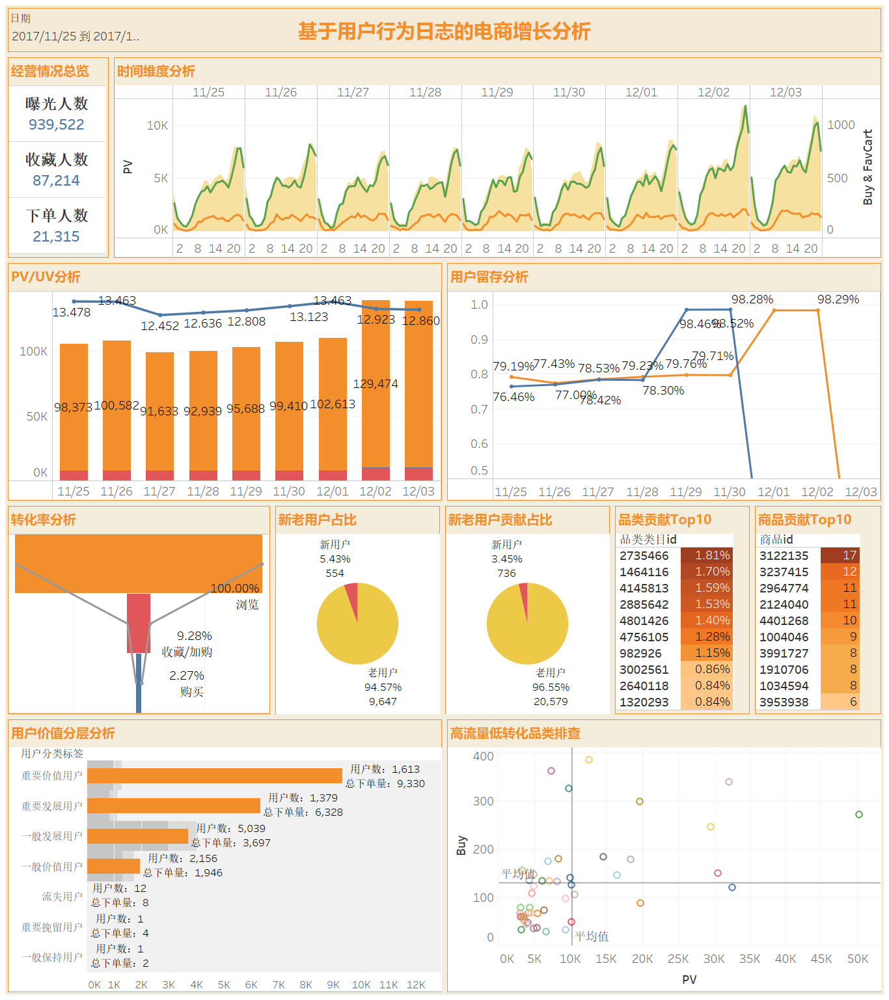

# 基于用户行为日志的电商增长分析与运营策略制定

## 项目简介

本项目基于阿里天池公开电商用户行为日志数据，对用户浏览（PV）、收藏（Fav）、加购（Cart）和购买（Buy）行为进行分析，围绕 **GMV 增长**构建完整的数据分析框架。

项目采用 **MySQL 数仓分层（ODS → DWD → DWS → ADS）+ Tableau 可视化** 的方式，实现从数据清洗、指标计算到业务洞察输出的完整流程，并针对平台运营提出优化建议。

---

## 项目目标

围绕 GMV 增长，从以下四个维度进行分析：

* 流量分析（Traffic）
* 转化分析（Conversion）
* 用户分析（User）
* 商品分析（Product）

最终定位影响 GMV 的关键因素，并提出可落地的运营策略。

---

## 技术栈

* **MySQL 8**
* **SQL**
* **Tableau**
* **数据仓库分层建模（ODS / DWD / DWS / ADS）**

---

## 数据仓库架构

```
原始用户行为日志（CSV）
            │
            ▼
      ODS（原始数据层）
            │
            ▼
 DWD（数据清洗与标准化层）
            │
            ▼
 DWS（业务指标汇总层）
            │
            ▼
 ADS（分析视图层）
            │
            ▼
 Tableau 可视化仪表盘
            │
            ▼
      GMV 增长分析与运营策略
```

---

## 分析框架

```
                    GMV 增长分析
                          │
    ┌─────────────┬─────────────┬─────────────┐
    │             │             │             │
 流量分析      转化分析      用户分析      商品分析
    │             │             │             │
PV / UV       漏斗分析       RFM分层       品类贡献
留存率         转化率         新老用户      长尾结构
活跃趋势       流失定位       用户价值      高流量低转化商品
时间分析       加购转化       GMV贡献       Top商品分析
```

---

## 项目结构

```
1taobao/
│
├── README.md
└── data/
    ├── UserBehavior.zip（你自行下载）
├── sql/
│   ├── ODS_DWD_DWS.sql
│   └── ADS.sql
├── tableau/
│   └── tableau.twbx
├── docs/
│   └── report.pdf
└── images/
    ├── dashboard.png
```

---

## Dashboard 展示

### 总览仪表盘

```


```

---

## 核心分析结果

### 1. 流量分析

* 周末及大促前夕用户活跃度明显提升。
* 用户次日留存率和三日留存率保持稳定，平台具备较好的用户粘性。
* 晚间 20:00–23:00 为访问和成交高峰时段。

---

### 2. 转化分析

* 最大流失发生在 **浏览 → 收藏/加购** 环节。
* 一旦用户进入购物车或收藏夹，最终购买转化能力明显提升。
* 建议优化商品详情页、推荐算法及首轮转化策略。

---

### 3. 用户分析

* VIP 用户和复购用户贡献了大部分购买行为，是平台 GMV 的核心来源。
* 新用户数量持续增长，但首单转化率偏低，存在较大的提升空间。
* RFM 分层结果可用于精细化运营和差异化营销。

---

### 4. 商品分析

* 平台呈现典型长尾商品结构，不依赖少数爆款商品。
* 存在部分高曝光、低转化商品，占用推荐资源但贡献有限。
* 建议优化商品池管理，提高流量利用效率。

---

## 💡 业务结论

* 平台整体流量基础良好，GMV 具备增长潜力。
* 当前增长瓶颈主要集中在浏览到收藏/加购阶段。
* GMV 主要由高价值老用户贡献，新用户首单转化仍有提升空间。
* 晚间 20:00–23:00 为核心成交窗口，可重点投放营销活动。
* 应将运营重点放在提升转化效率，而非单纯增加流量。

---

## 📌 项目亮点

* 基于真实电商用户行为日志完成端到端分析。
* 构建 ODS → DWD → DWS → ADS 数据仓库分层模型。
* 使用 SQL 完成数据清洗、聚合统计及业务指标计算。
* 搭建 Tableau 可视化仪表盘，覆盖流量、转化、用户、商品四大主题。
* 结合业务背景输出可执行的运营优化建议。

---

## 📚 数据来源

* 阿里天池公开数据集（User Behavior Data）
* 数据仅用于学习交流与个人项目展示，不用于商业用途。

---

## 🚀 如何复现

1. 创建 MySQL 数据库并导入原始数据。
2. 执行 `sql/ODS_DWD_DWS.sql` 完成 ODS、DWD、DWS 层构建。
3. 执行 `sql/ADS.sql` 生成 ADS 分析视图。
4. 使用 Tableau 打开工作簿并连接对应数据源，即可查看仪表盘。
